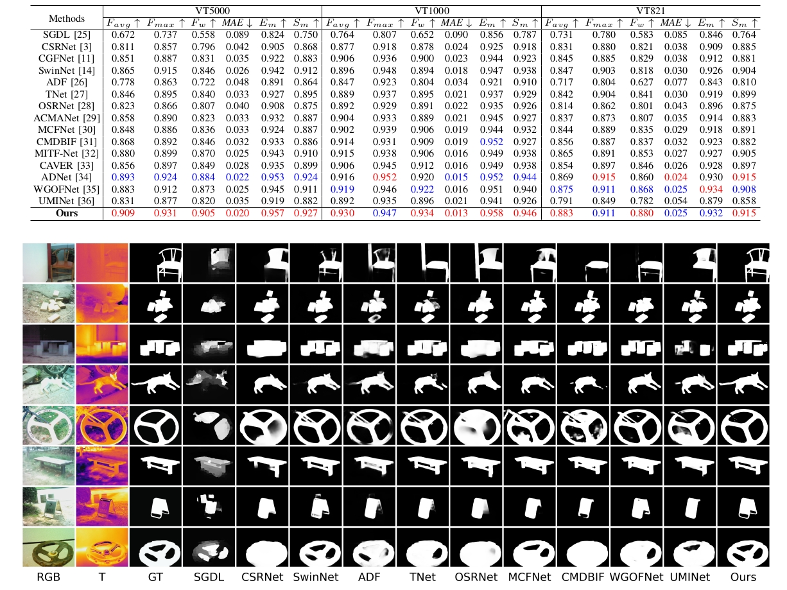

# KAN-SAM: Kolmogorov-Arnold Network Guided Segment Anything Model for RGB-T Salient Object Detection (IEEE International Conference on Multimedia and Expo (ICME25))
This is the results of the ICME2025 paper "KAN-SAM: Kolmogorov-Arnold Network Guided Segment Anything Model for RGB-T Salient Object Detection".
 
RGB-thermal salient object detection (RGB-T SOD) methods aim to identify visually significant objects by leveraging both RGB and thermal modalities to enable robust performance in complex scenarios, but they often suffer from limited generalization due to the constrained diversity of available datasets and the inefficiencies in constructing multi-modal representations. In this paper, we propose a novel prompt learning-based RGB-T SOD method, named KAN-SAM, which reveals the potential of visual foundational models for RGB-T SOD tasks. Specifically, we extend Segment Anything Model 2 (SAM2) for RGB-T SOD by introducing thermal features as guiding prompts through lightweight and accurate Kolmogorov-Arnold Network (KAN) adapters, which effectively enhance RGB representations and improve robustness. Furthermore, we introduce a mutually exclusive random masking strategy to reduce reliance on RGB data and improve generalization. Experimental results on benchmarks demonstrate superior performance over the state-of-the-art methods.

## Comparison with the state-of-the-art methods
{:style="：transform: rotate(90deg);"}

## VT821 results
[VT821](https://github.com/milotic233/KAN-SAM/blob/main/VT821.zip)

## VT1000 results
[VT1000](https://github.com/milotic233/KAN-SAM/blob/main/VT1000.zip)

## VT5000 results
[VT5000](https://github.com/milotic233/KAN-SAM/blob/main/VT5000.zip)

## Citation
Please cite this paper in your publications if it helps your research:

```
@inproceedings{li2025kansam,
  title={KAN-SAM: Kolmogorov-Arnold Network Guided Segment Anything Model for RGB-T Salient Object Detection},
  author={Li, Xingyuan and Hou, Ruichao and Ren, Tongwei and Wu, Gangshan},
  booktitle={2025 IEEE International Conference on Multimedia and Expo (ICME)},
  pages={1--6},
  year={2025},
  organization={IEEE}
}
```
